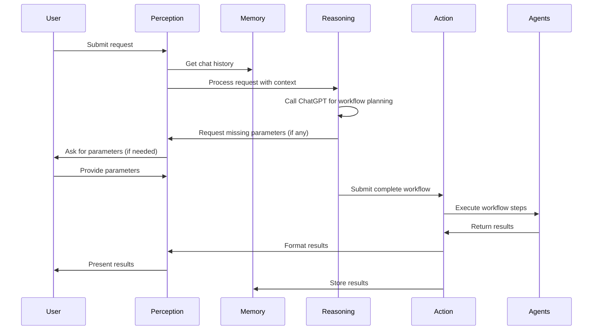

# Social Media Agent System - Developer Documentation

## Overview

The Social Media Agent System is a modular microservices architecture designed to process user requests and execute workflows across multiple social media platforms. The system leverages LLM capabilities to dynamically match user needs with appropriate agents and functions.

## System Architecture

```mermaid'
Agentfy/
├── core/                       # Core system components
│   ├── perception/             # Input validation & output formatting
│   ├── memory/                 # Data persistence & retrieval
│   ├── reasoning/              # Request analysis & workflow planning
│   ├── action/                 # Workflow execution
│   ├── monitoring/             # Execution monitoring (optional)
│   ├── communication/          # Inter-agent communication (optional)
│   └── learning/               # System optimization (optional)
├── common/                     # Shared utilities 
│   ├── models/                 # Data models
│   │   ├── __init__.py         
│   │   ├── messages.py         # User messages, chat history
│   │   ├── workflows.py        # Workflow definitions
│   │   ├── users.py            # User-related models
│   │   └── agents.py           # Agent-related  models 
│   ├── security/               # Security utilities
│   ├── utils/                  # Common utilities
│   └── exceptions/             # Custom exceptions
├── agents/                     # Platform-specific agents
│   ├── tiktok/                 # TikTok agents
│   ├── twitter/                # Twitter agents
│   └── ...                     # Other platform agents
└── main.py                     # FastAPI application
```
## Core Modules

### Perception Module

**Purpose**: Handles input validation, security checks, and output formatting.

**Key Files**:
- `module.py`: Main module functionality
- `validators.py`: Input validation utilities
- `formatters.py`: Output formatting utilities

The Perception Module acts as the boundary between the user and the system, ensuring inputs are safe and outputs are properly formatted.

### Memory Module

**Purpose**: Manages data persistence and retrieval.

**Key Files**:
- `module.py`: Main module functionality
- `database.py`: Database connection management
- `repositories.py`: Data access objects

The Memory Module stores chat histories, workflow definitions, execution results, and user preferences.

### Reasoning Module

**Purpose**: Analyzes user requests and builds workflows.

**Key Files**:
- `module.py`: Main module functionality (simplified to use ChatGPT)

The Reasoning Module leverages ChatGPT to analyze user requests and determine the appropriate agents and steps needed to fulfill them. It passes the user request and agent registry to ChatGPT and receives a structured workflow in response.

### Action Module

**Purpose**: Executes workflows generated by the Reasoning Module.

**Key Files**:
- `module.py`: Main module functionality (simplified execution engine)

The Action Module takes the workflow output from the Reasoning Module and executes each step in sequence, finding and calling the appropriate agent functions.

## Common Components

### Models

**Purpose**: Define data structures used throughout the system.

**Key Files**:
- `messages.py`: Message-related models
- `workflows.py`: Workflow-related models
- `agents.py`: Agent-related models
- `users.py`: User-related models

### Exceptions

**Purpose**: Define custom exceptions for error handling.

**Key Files**:
- `exceptions.py`: Custom exception hierarchy

### Utils

**Purpose**: Shared utility functions.

**Key Files**:
- `config.py`: Configuration loading
- `logging.py`: Structured logging
- `helpers.py`: Common helper functions

### Security

**Purpose**: Security-related utilities.

**Key Files**:
- `validators.py`: Security validation utilities
- `sanitizers.py`: Input sanitization utilities

## Agents

Each social media platform has its own set of agents divided into categories:

1. **Crawlers**: Data collection from social platforms
2. **Analysis**: Data processing and insights generation
3. **Interactive**: Actions that interact with social platforms

## FastAPI Integration

The `main.py` file integrates all modules into a cohesive API with these endpoints:

- `/process`: Process user requests and build workflows
- `/workflow/{id}/status`: Check workflow status
- `/workflow/parameters`: Update missing parameters and execute workflows

## Flow Diagram


## Development Getting Started

1. Clone the repository
2. Install dependencies: pip install -r requirements.txt
3. Create an agent_registry.json file with available agents and functions
4. Set environment variables or update config.py
5. Run the API: uvicorn main:app --reload

## Adding New Agents

1. Create a new directory under agents/ for the platform
2. Implement agent functions in appropriate files (crawler, analysis, interactive)
3. Add agent definitions to the agent registry JSON
4. The system will automatically incorporate these into workflows when appropriate

