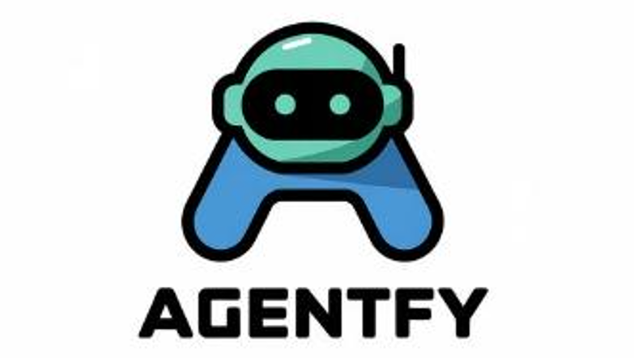

<p align="center">
  
</p>

# 🧠 Agentfy – Multi-Agent System for Social Media

[](https://www.python.org/)
[](https://github.com/callmeiks/Agentfy)
[](https://github.com/callmeiks/Agentfy)
[](https://github.com/callmeiks/Agentfy/issues)
[](https://github.com/callmeiks/Agentfy/pulls)
[](https://github.com/callmeiks/Agentfy/blob/main/LICENSE)
[](https://github.com/callmeiks)

## 📋 Overview

**Agentfy** is a modular, multi-agent coordination system purpose-built for automating tasks across social media ecosystems. Architected with a flexible **Model Context Protocol (MCP)**, the system enables intelligent workflow execution by leveraging **LLMs** to translate user intents into structured, goal-driven task chains.

Agentfy supports **multi-agent communication and collaboration**, allowing sub-agents to reason, perceive, and act together in real-time. It dynamically selects and routes requests to the most suitable agents and functions — no manual configuration needed.

<p align="center">
  
</p>

### 🧩 Agentfy Capabilities Table

| **Feature** | **Description** | **Example Prompt** |
|-------------|------------------|---------------------|
| 🎯 **Buyer Targeting & Outreach** | Smartly identify potential buyers and initiate personalized interactions across TikTok, Instagram, and more. | *"Find me some customers on Instagram and TikTok who are interested in buying a kitchen knife set and DM them my shop's new product: ___."* |
| 📢 **Cross-Platform Promotions** | Launch cross-platform promotions, generate ad content, and reach high-intent audiences at scale. | *"I'm hosting a hackathon at USC Viterbi. Here's my event info: ___. Can you send it to people on X and Instagram who may be interested, and also generate and post promo content across my accounts?"* |
| 📝 **Content Transformation & Posting** | Transform ideas, videos, or trends into tailored posts, captions, and media across self-authorized accounts. | *“Here’s my new unboxing video. Add subtitles, generate platform-optimized captions, and post to YouTube Shorts, Instagram Reels, and TikTok. Tag relevant hashtags and track early performance.”* |
| 🤖 **Automated Messaging & Support** | Reply to DMs, translate messages, and build 24/7 support flows in the customer's language. | *“Add a background task for me that automatically replies to customer DMs on TikTok and Instagram (make sure it's in the customer's language).”* |
| 🧠 **Creator Discovery & Competitor Monitoring** | Discover creators to partner with and monitor rival strategies across key platforms. | *“Find 50 livestreamers or influencers on Instagram and TikTok who would be a good fit to advertise my pillow set, send them a campaign brief.”* |


> **⚠️ Notes: Agentfy will integrating deeply with platforms like TikTok, Instagram, YouTube, X, Quora, WhatsApp, and more — ready to power the future of digital ops.**

## 🚦 Getting Started

1. Clone the repository `git clone https://github.com/callmeiks/Agentfy.git `
2. Navigate to the project directory `cd Agentfy`
3. Install dependencies: `pip install -r requirements.txt`
4. If you want to , please follow the instructions in the [➕ If You Need to Add New Sub Agents](#-if-you-need-to-add-new-sub-agents) section below.
   - This is optional and not required for basic usage
   - You can skip this step if you are just running the existing agents
5. Set environment variables in `.env` file
   - Required API keys and configurations can be found in `config.py`
   - Example `.env` file:
     ```
     OPENAI_API_KEY=your_key_here
     X_API_KEY=your_key_here
     X_API_SECRET=your_secret_here
     YOUTUBE_API_KEY=your_key_here
     ....
     ```

> ⚠️ Notes: You need to obtain API keys for the respective platforms you want to interact with (e.g., TikTok, Twitter, YouTube, etc.) If you are having trouble getting the API keys, please contact us lqiu314@gmail.com

## 🚀 Running the Program

You can interact with the program in three different ways:

### 1. Command Line Interface (CLI)
```bash
python run_agent_cli.py
```
- Runs the program in command-line interface mode
- Useful for quick testing and debugging

### 2. Streamlit Web Interface
```bash
streamlit run run_agent_app.py
```
- Runs the program with a Streamlit web interface
- Access the interface at `http://localhost:8501`
- User-friendly graphical interface

### 3. FastAPI Web Interface (Currently Unavailable, Do Not Use!!)
```bash
python run_agent_api.py
```
- Runs the program as a FastAPI server
- Access the web interface at `http://localhost:8000`
- RESTful API for programmatic access

> ⚠️ Note: The system is actively being improved. The author is currently adding more sub-agents and enhancing the overall accuracy and performance. Expect frequent updates and refinements.


## ➕ If You Need to Add New Sub Agents....

1. Create a new directory under `agents/` for the platform
2. Implement agent functions in appropriate files (crawler, analysis, interactive),  you may reference existing agents for structure and functionality
3. Update `agent_registry.json` file to include the new agent
   - Example:
     ```json
     {
       "AGENT_REGISTRY": {
         "platform_name": {
           "crawlers": [
             {
               "agent_id": "agent_name",
               "function_id": "function_name",
               "description": "Function description",
               "parameters": [
                 {
                   "name": "para1_name",
                   "type": "para1_type",
                   "description": "para1 description",
                   "required": true
                 },
                 {
                   "name": "para2_type",
                   "type": "para2_type",
                   "description": "para2 description",
                   "required": false
                 }
               ],
               "returns": {
                 "type": "return_type",
                 "description": "Return value description"
               }
             }
           ]
         }
       }
     }
     ```
4. The system will automatically incorporate these into workflows when appropriate

> ⚠️ Note: Ensure that the new agent adheres to the existing structure and naming conventions for seamless integration. The system is designed to be modular, so you can easily **ADD / DELETE** new agents without modifying the core logic. If you have any questions or need assistance, feel free to reach out to the development team.


## 🚀 Why Agentfy?

**Agentfy** is a modular, AI-first multi-agent system that enables social media automation, user engagement, data intelligence, and content operations **across TikTok, Instagram, YouTube, X (Twitter), WhatsApp**, and more.

It is built on a **flexible agent-based protocol**, allowing opaque apps to expose interfaces for agent-to-agent communication — unlocking new levels of productivity, creator support, and commerce automation.

> 🧬 Agentfy is not just a tool. It's an **agent operating protocol** for the next generation of LLM-enabled applications.


## 🧠 Agentfy as an Open Agent Protocol (Inspired by A2A + MCP)

Agentfy is designed as more than just a workflow engine — it is a **prototype of an open agent protocol**, enabling seamless interoperability across intelligent systems, opaque apps, and task-oriented agents.

Inspired by:

- 🔁 [**Google’s A2A (Agents-to-Agents)**](https://github.com/google/A2A): agent endpoints that expose **capabilities** in a standardized, callable way  
- 🧩 [**Anthropic’s Modular Control Plane (MCP)**](https://docs.anthropic.com/en/docs/agents-and-tools/mcp): orchestration layer that routes user goals to the best-suited agents or tools dynamically

### 🔌 Vision

Agentfy enables **inter-agent communication**, **function discovery**, and **LLM-to-agent routing** by acting as a lightweight **social operations protocol layer**. Our long-term goal is to establish:

- 🧠 **Intent-to-action routing**: Convert natural language into modular, executable calls to real-world agents  
- 🛰️ **Cross-platform orchestration**: Let one agent call another — e.g., "TikTok Agent" → "CRM Agent" → "Stripe Agent"  
- 🌐 **Interoperability across closed ecosystems**: Bridge the gap between siloed platforms like TikTok, WhatsApp, Shopify, YouTube, etc.

> Think: an open protocol layer that makes social agents interoperable, extensible, and pluggable — like HTTP for intelligent tools.

### 🌱 Current Architecture Enables:

- Dynamic loading of new agents via registry-based architecture  
- Modular sub-agent pipelines (Perception, Reasoning, Action, Memory)  
- Autonomous tool selection based on user input and agent registry functions  
- Early groundwork for exposing agents as callable microservices (via CLI, Streamlit, or FastAPI)

> 💡 Join us in prototyping what **agent interoperability** looks like — from buyer targeting to content transformation to commerce fulfillment.


## 🙏 Sponsorship & Support
This project is sponsor by [TikHub](https://tikhub.io), a platform that empower developers and businesses with seamless APIs to transform social media data into actionable insights.
They support Data Access to TikTok, Douyin, Instagram, YouTube, X (Twitter), Xiaohongshu, Lemon8, Bilibili, and more.

- **🏠 Home**: [https://www.tikhub.io](https://www.tikhub.io)
- **👨‍💻 Github**: [https://github.com/TikHub](https://github.com/TikHub)
- **⚡ Documents (Swagger UI)**: [https://api.tikhub.io](https://api.tikhub.io)
- **🦊 Documents (Apifox UI)**: [https://docs.tikhub.io](https://docs.tikhub.io)
- **🍱 SDK**: [https://github.com/TikHub/TikHub-API-Python-SDK](https://github.com/TikHub/TikHub-API-Python-SDK)
- **🐙 Demo Code (GitHub)**: [https://github.com/TikHub/TikHub-API-Demo](https://github.com/TikHub/TikHub-API-Demo)
- **📶 API Status**: [https://monitor.tikhub.io](https://monitor.tikhub.io)
- **📧 Support**: [Discord Server](https://discord.gg/aMEAS8Xsvz)


## 📬 Contact

Have questions, want to contribute, or need help integrating Agentfy into your stack?

Feel free to reach out:

- 📧 **Email:** [lqiu314@gmail.com](mailto:lqiu314@gmail.com) OR [evil0ctal1985@gmail.com](mailto:evil0ctal1985@gmail.com) 
- 🧑‍💻 **GitHub:** [@callmeiks](https://github.com/callmeiks) OR [@Evil0ctal](https://github.com/Evil0ctal)
- 💡 Let's build the next generation of **agent-powered digital infrastructure** — together.
